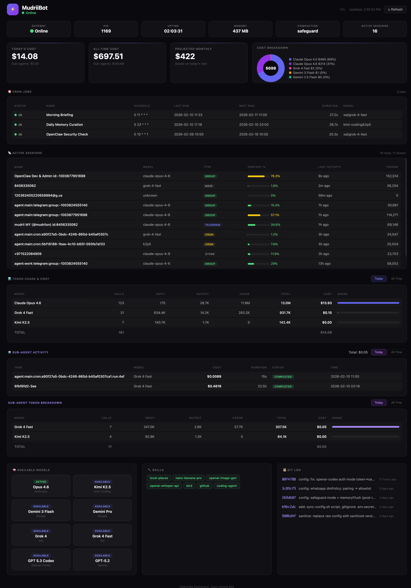

# OpenClaw Dashboard

A beautiful, zero-dependency command center for [OpenClaw](https://github.com/openclaw/openclaw) AI agents.



## Features

- 📊 **Token Usage Tracking** — Monitor API costs across all models (today vs all-time)
- ⏰ **Cron Jobs** — View scheduled jobs and their status
- 🧩 **Skills Grid** — All enabled skills at a glance
- 📋 **Kanban Board** — Track tasks and progress (optional)
- 🎨 **Customizable** — Configure bot name, theme colors, visible panels
- 📱 **Responsive** — Works on desktop and mobile
- 🔒 **Local Only** — Runs on localhost, no external dependencies
- 🐧 **Cross-Platform** — macOS and Linux supported

## Quick Start

### One-Line Install (Recommended)

```bash
curl -fsSL https://raw.githubusercontent.com/openclaw-community/dashboard/main/install.sh | bash
```

This will:
1. Install to `~/.openclaw/dashboard`
2. Create a default config
3. Start the server automatically
4. Open http://127.0.0.1:8080

### Manual Install

```bash
# Clone the repo
git clone https://github.com/openclaw-community/dashboard.git ~/.openclaw/dashboard
cd ~/.openclaw/dashboard

# Create your config
cp examples/config.minimal.json config.json
nano config.json  # Set your bot name

# Generate initial data
./refresh.sh

# Start the server
python3 -m http.server 8080 &

# Open in browser
open http://127.0.0.1:8080  # macOS
xdg-open http://127.0.0.1:8080  # Linux
```

## Configuration

Edit `config.json` to customize:

```json
{
  "bot": {
    "name": "My Bot",
    "emoji": "🤖"
  },
  "theme": {
    "accent": "#22c55e"
  },
  "panels": {
    "kanban": false
  }
}
```

See [docs/CONFIGURATION.md](docs/CONFIGURATION.md) for all options.

## Data Refresh

The dashboard reads data from your OpenClaw installation. To update:

```bash
# Manual refresh
./refresh.sh

# Or set up automatic refresh via cron
crontab -e
# Add: */15 * * * * ~/.openclaw/dashboard/refresh.sh
```

## Uninstall

```bash
./uninstall.sh
```

Or manually:
```bash
# macOS
launchctl unload ~/Library/LaunchAgents/com.openclaw.dashboard.plist
rm -rf ~/.openclaw/dashboard

# Linux
systemctl --user stop openclaw-dashboard
rm -rf ~/.openclaw/dashboard
```

## Requirements

### Dependencies

- **Python 3.6+** — For data refresh script and local server
- **Git** — For cloning the repository (optional, can download ZIP)
- **OpenClaw** — Installed at `~/.openclaw` ([install guide](https://docs.openclaw.ai))

### System Requirements

- **macOS** 10.15+ or **Linux** (Ubuntu 18.04+, Debian 10+, etc.)
- Modern web browser (Chrome, Firefox, Safari, Edge)
- ~10MB disk space

### Optional

- **jq** — For debugging JSON files
- **cron** — For automatic data refresh

## Contributing

See [CONTRIBUTING.md](CONTRIBUTING.md) for guidelines.

## License

MIT License — see [LICENSE](LICENSE)

---

Made with 🦞 for the [OpenClaw](https://github.com/openclaw/openclaw) community
