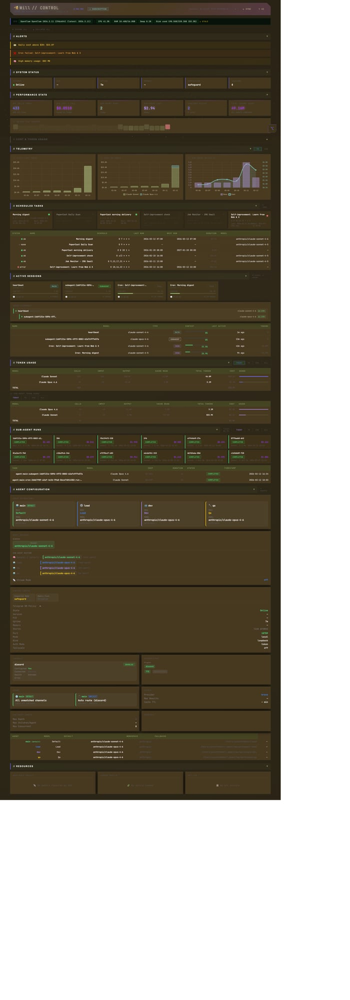
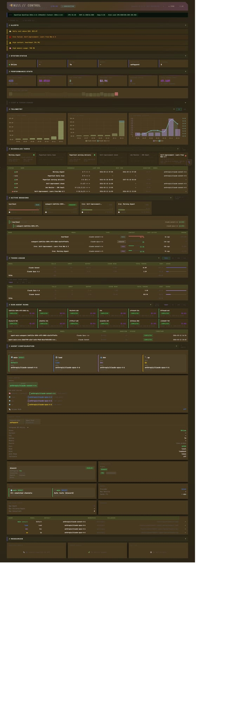

# WILL // CONTROL — OpenClaw Dashboard

> A terminal-aesthetic control panel for [OpenClaw](https://github.com/openclaw/openclaw) Gateway — real-time agent monitoring with a "Subdued Succulent" warm-earthy UI.



## Features

- **Live Gateway Monitoring** — status, PID, uptime, memory, compaction mode
- **Billing-Aware Cost Display** — auto-detects subscription / API / local model and shows the right metric:
  - **Subscription plan** → token count + usage intensity bar (no misleading $ figures)
  - **API (pay-per-token)** → dollar cost with daily/all-time/projected monthly
  - **Local model** → token count, $0 API cost
- **30-Day Cost Heatmap** — colour-coded daily spend at a glance
- **Telemetry Charts** — Chart.js bar charts: daily cost trend, cost by model, sub-agent activity
- **Session Context Bars** — per-session context-window usage with colour-coded warnings
- **Cron Job Grid** — status, last run, next run for all scheduled tasks
- **Token Usage Tables** — today / 7d / 30d / all-time tabs, sub-agent breakdown
- **Sub-Agent Run Cards** — per-run cost, duration, status grid
- **Agent Configuration Panel** — all agents, model routing, channels, hooks, capabilities
- **System Metrics** — CPU / RAM / SWAP / DISK pills with configurable warn/critical thresholds
- **Vanta.js DOTS** animated background, CRT scanlines, JetBrains Mono font



## Quick Start

### 1. Install

```bash
# macOS ARM
curl -L https://github.com/mudrii/openclaw-dashboard/releases/latest/download/openclaw-dashboard-darwin-arm64 \
  -o openclaw-dashboard && chmod +x openclaw-dashboard

# Or build from source (requires Go ≥ 1.21)
git clone https://github.com/yusenthebot/openclaw-dashboard
cd openclaw-dashboard
go build -o openclaw-dashboard .
```

### 2. Configure

Copy the example config and edit to match your setup:

```bash
cp examples/config.minimal.json config.json
```

```json
{
  "bot": {
    "name": "MyAgent",
    "emoji": "🤖"
  },
  "billingMode": "subscription",
  "timezone": "America/New_York",
  "server": { "port": 8080, "host": "127.0.0.1" },
  "ai": { "enabled": true, "gatewayPort": 18789 }
}
```

**`billingMode` options:**

| Value | Display |
|-------|---------|
| `"subscription"` | Token counts + usage intensity bar |
| `"api"` | Dollar cost (default if unset) |
| `"local"` | Token counts, $0 API cost |

> You can also click the badge in the header to cycle modes — preference saved in localStorage.

### 3. Run

```bash
./openclaw-dashboard --port 8080
# Open http://127.0.0.1:8080
```

To run in background:

```bash
nohup ./openclaw-dashboard --port 8080 > /tmp/dash.log 2>&1 &
```

## Configuration Reference

| Field | Default | Description |
|-------|---------|-------------|
| `bot.name` | `"OpenClaw Dashboard"` | Agent display name |
| `bot.emoji` | `"🦞"` | Agent emoji |
| `billingMode` | `"api"` | `subscription` / `api` / `local` |
| `timezone` | `"UTC"` | Display timezone (IANA) |
| `refresh.intervalSeconds` | `30` | Poll interval |
| `server.port` | `8080` | HTTP port (localhost only) |
| `server.host` | `"127.0.0.1"` | Bind address |
| `ai.gatewayPort` | `18789` | OpenClaw Gateway WebSocket port |
| `alerts.dailyCostHigh` | `50` | Red alert threshold ($) |
| `alerts.dailyCostWarn` | `20` | Yellow alert threshold ($) |
| `alerts.contextPct` | `80` | Context usage warning (%) |
| `system.warnPercent` | `70` | System metric warn threshold |
| `system.criticalPercent` | `85` | System metric critical threshold |

## Customisation

### Billing Mode Detection Order

1. **localStorage** — user clicked the badge to override
2. **`config.json` → `billingMode`** — server-side config (injected as `<meta name="oc-billing">`)
3. **Auto-detect from model name** — `ollama:*` / `lm-studio:*` → `local`, otherwise `api`

### Color Palette — Subdued Succulent

| Variable | Value | Use |
|----------|-------|-----|
| `--bg` | `#282215` | Page background (warm olive-brown) |
| `--accent` | `#A8B87A` | Sage green — primary accent |
| `--accent2` | `#D4905A` | Terracotta — secondary accent |
| `--cyan` | `#7ABCB8` | Jade teal — subscription mode, info |
| `--purple` | `#A890C8` | Aloe lavender — sub-agents |
| `--text` | `rgba(238,225,195,0.92)` | Warm cream text |

### Rebuilding after index.html edits

The Go binary embeds `index.html` at compile time:

```bash
go build -o openclaw-dashboard .
./openclaw-dashboard --port 8080
```

## Architecture

```
openclaw-dashboard (binary)
  ├── main.go          — CLI flags, startup
  ├── server.go        — HTTP server, /api/refresh endpoint, meta injection
  ├── config.go        — Config struct, JSON loading, validation
  ├── system_service.go — CPU/RAM/disk/swap collection
  ├── chat.go          — AI assistant WebSocket bridge
  └── index.html       — Embedded SPA (all UI, JS, CSS in one file)
```

The `/api/refresh` endpoint proxies the OpenClaw Gateway REST API and enriches it with:
- Per-session token/cost aggregation from `~/.openclaw/agents/*/sessions/*.jsonl`
- System metrics (CPU, RAM, disk, swap)
- Sub-agent run history

## Differences from upstream

This fork ([mudrii/openclaw-dashboard](https://github.com/mudrii/openclaw-dashboard)) adds:

- **Billing mode system** — subscription / API / local with smart detection
- **Subdued Succulent theme** — warm earthy palette replacing cold green neon
- **Chart.js bar charts** — replacing SVG line charts for Telemetry panels
- **30-Day Cost Heatmap** — colour-coded daily cost grid
- **Session context bars** — per-session context usage with warnings
- **Sub-agent run cards** — grid + table with today/7d/30d/all tabs
- **Agent configuration panel** — full agent/model/channel/hook viewer
- **Performance KPI row** — API calls, avg cost, active sessions
- **Vanta.js DOTS** background (softer than NET)

## Requirements

- OpenClaw Gateway running on localhost
- Go ≥ 1.21 (for building from source)
- Tested on macOS (arm64) and Linux (amd64)

## License

MIT — see [LICENSE](LICENSE)
