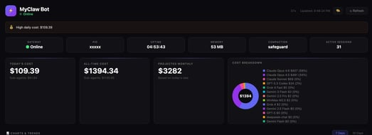
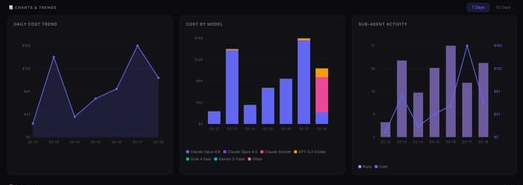
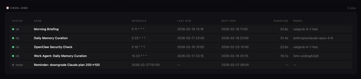
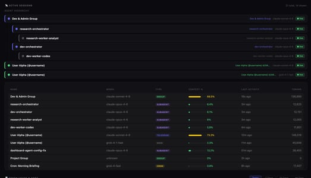
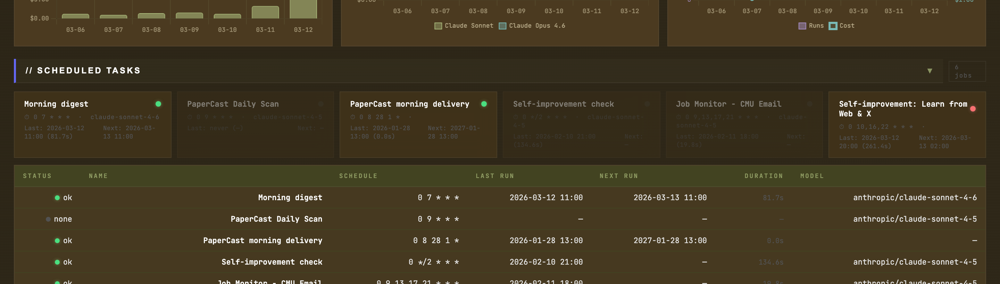
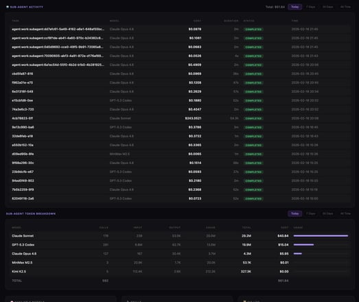
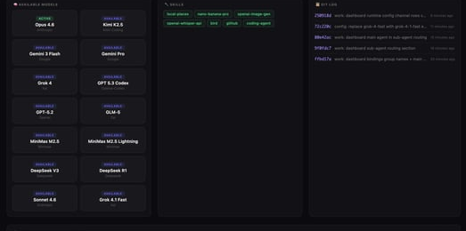
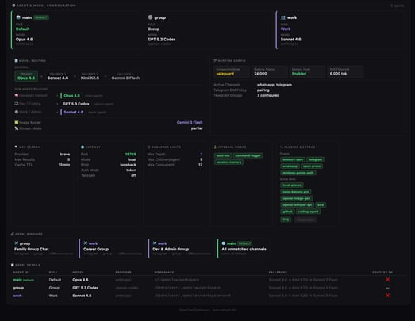

# OpenClaw Dashboard

A beautiful, zero-dependency command center for [OpenClaw](https://github.com/openclaw/openclaw) AI agents.


## Why This Exists

When you run OpenClaw seriously — multiple agents, dozens of cron jobs, sub-agents spawning sub-agents, several Telegram groups and Whatsapp, Slack, and Discord channels, 10+ models, multiple agents and sub-agents — information gets scattered fast.

**The problem:** there was no single place to answer the obvious questions:
- Is my gateway actually running right now?
- How much have I spent today, and which model is burning the most?
- Which cron jobs ran, which failed, and when does the next one fire?
- What sessions are active and how much context are they consuming?
- Are my sub-agents doing useful work or spinning in circles?
- What's the cost trend over the last 7 days — am I accelerating?

The only way to answer these was digging through log files, running CLI commands, and mentally stitching together a picture from 5 different sources. That friction adds up.

**The solution:** a single local page that collects everything in one place — gateway health, costs, cron status, active sessions, sub-agent runs, model usage, git log — refreshed automatically, no login, no cloud, no external dependencies. Open a browser tab, get the full picture in seconds.

It's not trying to replace the OpenClaw CLI or Telegram interface. It's the at-a-glance overview layer that tells you whether everything is healthy and where your money and compute are going — so you can make decisions without hunting for data.

## Features

### 12 Dashboard Panels

1. **📊 Top Metrics Bar** — Live CPU, RAM, swap, disk + OpenClaw version + gateway — always on, colour-coded by configurable thresholds (see [Top Metrics Bar](#top-metrics-bar))
2. **🔔 Header Bar** — Bot name, online/offline status, auto-refresh countdown, theme picker
3. **⚠️ Alerts Banner** — Smart alerts for high costs, failed crons, high context usage, gateway offline
4. **💚 System Health** — Gateway status, PID, uptime, memory, compaction mode, active session count
5. **💰 Cost Cards** — Today's cost, all-time cost, projected monthly, cost breakdown donut chart
6. **⏰ Cron Jobs** — All scheduled jobs with status, schedule, last/next run, duration, model
7. **📡 Active Sessions** — Recent sessions with model, type badges (DM/group/cron/subagent), context %, tokens
8. **📊 Token Usage & Cost** — Per-model breakdown with 7d/30d/all-time tabs, usage bars, totals
9. **🤖 Sub-Agent Activity** — Sub-agent runs with cost, duration, status + token breakdown (7d/30d tabs)
10. **📈 Charts & Trends** — Cost trend line, model cost breakdown bars, sub-agent activity — all pure SVG, 7d/30d toggle
11. **🧩 Bottom Row** — Available models grid, skills list, git log
12. **💬 AI Chat** — Ask questions about your dashboard in natural language, powered by your OpenClaw gateway

### Key Features

- 🔄 **On-Demand Refresh** — `server.py` refreshes data when you open the dashboard (no stale data)
- ⏱️ **Auto-Refresh** — Page auto-refreshes every 60 seconds with countdown timer
- 🎨 **6 Built-in Themes** — 3 dark (Midnight, Nord, Catppuccin Mocha) + 3 light (GitHub, Solarized, Catppuccin Latte), switchable from the UI
- 🖌️ **Glass Morphism UI** — Subtle transparency and hover effects
- 📱 **Responsive** — Adapts to desktop, tablet, and mobile
- 🔒 **Local Only** — Runs on localhost, no external dependencies
- 🛡️ **Rate Limiting** — 10 req/min per-IP on `/api/chat` (Go + Python, 429 + Retry-After)
- ⏱️ **HTTP Timeouts** — Read 30s / Write 90s / Idle 120s (Go server)
- 🐧 **Cross-Platform** — macOS and Linux
- ⚡ **Zero Dependencies** — Pure HTML/CSS/JS frontend, Python stdlib backend, or single Go binary
- 📊 **Top Metrics Bar** — Always-on CPU/RAM/swap/disk + gateway status, per-metric thresholds, macOS + Linux
- 💬 **AI Chat** — Natural language queries about costs, sessions, crons, and config via OpenClaw gateway
- 🎯 **Accurate Model Display** — 5-level resolution chain ensures every session/sub-agent shows its real model, not the default
- 🔍 **Runtime Observability** — `/api/system` now includes live gateway runtime state (liveness, readiness, failing deps, uptime, PID, memory) sourced from `/healthz`, `/readyz`, and `openclaw status --json`
- 🟡 **Gateway Readiness Alerts** — Alert banner shows `🟡 Gateway not ready: discord` (or any failing dep) and auto-clears on recovery; distinct from offline/online state
- ⚡ **Gateway Runtime + Config Cards** — System Settings split into two panels: Gateway Runtime (live probes) and Gateway Config (static config snapshot)

## Quick Start

Two server options — choose what fits your environment:

| | Go Binary | Python Server |
|---|---|---|
| **Install** | Download one file | Clone repo + Python 3 |
| **Runtime deps** | None | Python 3.6+ |
| **Throughput** | 37,063 req/s | 940 req/s |
| **Deploy size** | 6.2 MB | ~81 MB (Python framework) |
| **Best for** | Production, headless, containers | Quick setup, customization |

> See [BENCHMARK.md](BENCHMARK.md) for the full 9-category performance comparison.

### Option A: Go Binary (recommended)

Download a single pre-built binary — no runtime dependencies needed:

```bash
# macOS (Apple Silicon)
curl -L https://github.com/mudrii/openclaw-dashboard/releases/latest/download/openclaw-dashboard-darwin-arm64 -o openclaw-dashboard
chmod +x openclaw-dashboard
./openclaw-dashboard --port 8080

# macOS (Intel)
curl -L https://github.com/mudrii/openclaw-dashboard/releases/latest/download/openclaw-dashboard-darwin-amd64 -o openclaw-dashboard
chmod +x openclaw-dashboard
./openclaw-dashboard --port 8080

# Linux (x86_64)
curl -L https://github.com/mudrii/openclaw-dashboard/releases/latest/download/openclaw-dashboard-linux-amd64 -o openclaw-dashboard
chmod +x openclaw-dashboard
./openclaw-dashboard --port 8080

# Linux (ARM64 / Raspberry Pi)
curl -L https://github.com/mudrii/openclaw-dashboard/releases/latest/download/openclaw-dashboard-linux-arm64 -o openclaw-dashboard
chmod +x openclaw-dashboard
./openclaw-dashboard --port 8080
```

Verify download integrity:
```bash
curl -L https://github.com/mudrii/openclaw-dashboard/releases/latest/download/checksums-sha256.txt -o checksums-sha256.txt
shasum -a 256 -c checksums-sha256.txt
```

> **Note:** Place `config.json`, `themes.json`, and `refresh.sh` in the same directory as the binary for full functionality.

### Option B: Python Server

```bash
# One-line install
curl -fsSL https://raw.githubusercontent.com/mudrii/openclaw-dashboard/main/install.sh | bash
```

This will:
1. Install to `~/.openclaw/dashboard`
2. Create a default config
3. Run initial data refresh
4. Start `server.py` as a system service
5. Open http://127.0.0.1:8080

### Manual Install (Python)

```bash
# Clone the repo
git clone https://github.com/mudrii/openclaw-dashboard.git ~/.openclaw/dashboard
cd ~/.openclaw/dashboard

# Create your config
cp examples/config.minimal.json config.json
nano config.json  # Set your bot name

# Start the server (refreshes data on-demand)
python3 server.py &

# Or bind to LAN for access from other devices
python3 server.py --bind 0.0.0.0 &

# Open in browser
open http://127.0.0.1:8080  # macOS
xdg-open http://127.0.0.1:8080  # Linux
```

### Build from Source (Go)

```bash
git clone https://github.com/mudrii/openclaw-dashboard.git
cd openclaw-dashboard
go build -ldflags="-s -w" -o openclaw-dashboard .
./openclaw-dashboard --port 8080
```

### Docker

```bash
# Go binary (default — 30MB image, recommended)
docker build -t openclaw-dashboard .
docker run -p 8080:8080 -v ~/.openclaw:/home/dashboard/.openclaw openclaw-dashboard

# Python server (alternative — 180MB image)
docker build --target python -t openclaw-dashboard:python .
docker run -p 8080:8080 -v ~/.openclaw:/home/dashboard/.openclaw openclaw-dashboard:python
```

### Nix Flake

```bash
# Go binary (default)
nix run github:mudrii/openclaw-dashboard

# Python server
nix run github:mudrii/openclaw-dashboard#python-server

# Dev shell (Go + Python + tools)
nix develop github:mudrii/openclaw-dashboard
```

## Themes

Click the 🎨 button in the header to switch themes instantly — no reload or server restart needed. Choice persists via `localStorage`.

| Theme | Type | Vibe |
|-------|------|------|
| 🌙 **Midnight** | Dark | Original glass morphism (default) |
| 🏔️ **Nord** | Dark | Arctic blue, calm, great for long sessions |
| 🌸 **Catppuccin Mocha** | Dark | Warm pastels, easy on eyes |
| ☀️ **GitHub Light** | Light | Clean, professional, high readability |
| 🌅 **Solarized Light** | Light | Scientifically optimized contrast |
| 🌻 **Catppuccin Latte** | Light | Soft pastels |

### Custom Themes

Add your own themes by editing `themes.json`. Each theme defines 19 CSS color variables:

```json
{
  "my-theme": {
    "name": "My Theme",
    "type": "dark",
    "icon": "🎯",
    "colors": {
      "bg": "#1a1a2e",
      "surface": "rgba(255,255,255,0.03)",
      "surfaceHover": "rgba(255,255,255,0.045)",
      "border": "rgba(255,255,255,0.06)",
      "accent": "#e94560",
      "accent2": "#0f3460",
      "green": "#4ade80",
      "yellow": "#facc15",
      "red": "#f87171",
      "orange": "#fb923c",
      "purple": "#a78bfa",
      "text": "#e5e5e5",
      "textStrong": "#ffffff",
      "muted": "#737373",
      "dim": "#525252",
      "darker": "#404040",
      "tableBg": "rgba(255,255,255,0.025)",
      "tableHover": "rgba(255,255,255,0.05)",
      "scrollThumb": "rgba(255,255,255,0.1)"
    }
  }
}
```

## Architecture

```
server.py / openclaw-dashboard (Go)   ← HTTP server (choose one)
  ├── index.html   ← Single-page dashboard (fetches /api/refresh, /api/chat)
  ├── themes.json  ← Theme definitions (user-editable)
  ├── refresh.sh   ← Data collection script (called by server)
  └── data.json    ← Generated data (auto-refreshed)
```

**Two server implementations, same API:**

| | Python (`server.py`) | Go (`openclaw-dashboard`) |
|---|---|---|
| Serves `index.html` | From disk | Embedded in binary (`//go:embed`) |
| `/api/refresh` | Blocking (waits for `refresh.sh`) | Stale-while-revalidate (instant response) |
| `/api/chat` | Reads `data.json` per request | Mtime-cached `data.json` (dual raw+parsed cache) |
| `/api/system` | `system_metrics.py` — TTL cache, stale-serving | `SystemService` — parallel collectors, RWMutex cache |
| Static files | Allowlisted (`themes.json`, `data.json`, `index.html`) | Allowlisted only (`themes.json`) |
| Rate limiting | 10 req/min per-IP on `/api/chat` | 10 req/min per-IP on `/api/chat` |
| HTTP timeouts | N/A (stdlib defaults) | Read 30s / Write 90s / Idle 120s |
| Pre-warm | None | Runs `refresh.sh` at startup |
| Shutdown | Clean thread exit | Graceful (drains requests, 5s timeout) |
| Gateway limit | 1MB response cap | 1MB response cap |
| Tests | `pytest` (122 tests) | `go test -race` (87 tests) |

When you open the dashboard, `index.html` calls `/api/refresh`. The server runs `refresh.sh` (with 30s debounce) to collect fresh data from your OpenClaw installation, then returns the JSON. No cron jobs needed.

The `/api/chat` endpoint accepts `{"question": "...", "history": [...]}` and forwards a stateless request to the OpenClaw gateway's OpenAI-compatible `/v1/chat/completions` endpoint, with a system prompt built from live `data.json`.

### Frontend Module Structure

The entire frontend lives in a single `<script>` tag inside `index.html` — zero dependencies, no build step. The JS is organized into 7 plain objects:

```
┌─────────────────────────────────────────────┐
│                 App.init()                   │
│       (wires everything, starts timer)       │
└───────┬──────────────┬──────────────┬───────┘
        │              │              │
   ┌────▼────┐   ┌─────▼─────┐  ┌────▼─────┐
   │  State  │◄──│ DataLayer │  │  Theme   │
   │ (truth) │   │  (fetch)  │  │ (colors) │
   └────┬────┘   └───────────┘  └──────────┘
        │
   ┌────▼────────────┐
   │  DirtyChecker   │
   │ (what changed?) │
   └────┬────────────┘
        │
   ┌────▼────┐   ┌────────┐
   │Renderer │   │  Chat  │
   │  (DOM)  │   │  (AI)  │
   └─────────┘   └────────┘
```

| Module | Responsibility |
|--------|----------------|
| **State** | Single source of truth — holds `data`, `prev`, `tabs`, `countdown`. Produces immutable deep-frozen snapshots for each render cycle. |
| **DataLayer** | Stateless fetch with `_reqId` counter for out-of-order protection. Returns parsed JSON or `null`. |
| **DirtyChecker** | Computes 13 boolean dirty flags by comparing current snapshot against `State.prev`. Uses `stableSnapshot()` to strip volatile timestamps from crons/sessions. |
| **Renderer** | Pure DOM side-effects. Receives frozen snapshot + pre-computed flags, dispatches to 14 section renderers. Owns the agent hierarchy tree, recent-finished buffer, and all chart SVG rendering. |
| **Theme** | Self-contained theme engine — loads `themes.json`, applies CSS variables, persists choice to `localStorage`. |
| **Chat** | AI chat panel — manages history, sends stateless requests to `/api/chat`. |
| **App** | Wiring layer — `init()` starts theme + timer + first fetch; `renderNow()` captures snapshot → computes flags → schedules render via `requestAnimationFrame`; `commitPrev(snap)` runs inside rAF to prevent fetch/paint races. |

All inline `onclick` handlers route through `window.OCUI` — a thin namespace that calls `State.setTab()` / `App.renderNow()`. No bare globals remain outside the module objects and top-level utilities (`$`, `esc`, `safeColor`, `relTime`).

See [ARCHITECTURE.md](ARCHITECTURE.md) for the full specification.

## Configuration

Edit `config.json`:

```json
{
  "bot": {
    "name": "My Bot",
    "emoji": "🤖"
  },
  "theme": {
    "preset": "nord"
  },
  "refresh": {
    "intervalSeconds": 30
  },
  "server": {
    "port": 8080,
    "host": "127.0.0.1"
  },
  "ai": {
    "enabled": true,
    "gatewayPort": 18789,
    "model": "your-model-id",
    "maxHistory": 6,
    "dotenvPath": "~/.openclaw/.env"
  },
  "system": {
    "enabled": true,
    "pollSeconds": 10,
    "diskPath": "/",
    "cpu":  { "warn": 80, "critical": 95 },
    "ram":  { "warn": 75, "critical": 90 },
    "swap": { "warn": 80, "critical": 95 },
    "disk": { "warn": 85, "critical": 95 }
  }
}
```

### Configuration Options

| Key | Default | Description |
|-----|---------|-------------|
| `bot.name` | `"OpenClaw Dashboard"` | Dashboard title |
| `bot.emoji` | `"🦞"` | Avatar emoji |
| `theme.preset` | `"midnight"` | Default theme (`midnight`, `nord`, `catppuccin-mocha`, `github-light`, `solarized-light`, `catppuccin-latte`) |
| `timezone` | `"UTC"` | IANA timezone for all time calculations (requires Python 3.9+) |
| `refresh.intervalSeconds` | `30` | Debounce interval for refresh |
| `alerts.dailyCostHigh` | `50` | Daily cost threshold for high alert ($) |
| `alerts.dailyCostWarn` | `20` | Daily cost threshold for warning alert ($) |
| `alerts.contextPct` | `80` | Context usage % threshold for alerts |
| `alerts.memoryMb` | `640` | Gateway memory threshold (MB) for alerts |
| `server.port` | `8080` | Server port (also `--port` / `-p` flag or `DASHBOARD_PORT` env) |
| `server.host` | `"127.0.0.1"` | Server bind address (also `--bind` / `-b` flag or `DASHBOARD_BIND` env) |
| `ai.enabled` | `true` | Enable/disable the AI chat panel and `/api/chat` endpoint |
| `ai.gatewayPort` | `18789` | Port of your OpenClaw gateway |
| `ai.model` | `""` | Model to use for chat — any model ID registered in your OpenClaw gateway |
| `ai.maxHistory` | `6` | Number of previous messages to include for context |
| `ai.dotenvPath` | `"~/.openclaw/.env"` | Path to `.env` file containing `OPENCLAW_GATEWAY_TOKEN` |
| `system.enabled` | `true` | Enable/disable the top metrics bar and `/api/system` endpoint |
| `system.pollSeconds` | `10` | How often the browser polls `/api/system` (seconds, 2–60) |
| `system.metricsTtlSeconds` | `10` | Server-side metrics cache TTL (seconds) |
| `system.versionsTtlSeconds` | `300` | Version/gateway probe cache TTL (seconds) |
| `system.gatewayTimeoutMs` | `1500` | Timeout for gateway liveness probe (ms) |
| `system.diskPath` | `"/"` | Filesystem path to report disk usage for |
| `system.warnPercent` | `70` | Global warn threshold (% used) — overridden by per-metric values |
| `system.criticalPercent` | `85` | Global critical threshold (% used) — overridden by per-metric values |
| `system.cpu.warn` | `80` | CPU warn threshold (%) |
| `system.cpu.critical` | `95` | CPU critical threshold (%) |
| `system.ram.warn` | `80` | RAM warn threshold (%) |
| `system.ram.critical` | `95` | RAM critical threshold (%) |
| `system.swap.warn` | `80` | Swap warn threshold (%) |
| `system.swap.critical` | `95` | Swap critical threshold (%) |
| `system.disk.warn` | `80` | Disk warn threshold (%) |
| `system.disk.critical` | `95` | Disk critical threshold (%) |

### Top Metrics Bar

The top bar shows live host metrics — always visible above the alerts banner.

**Metrics displayed:**
| Pill | What it shows |
|------|--------------|
| CPU | Usage % (current delta, not boot average) |
| RAM | Used / Total GB |
| Swap | Usage % |
| Disk | Used / Total GB (used %) |
| OpenClaw | Installed version |
| GW | Gateway status (online / offline) |

**Colour coding:**
- 🟢 Green — below warn threshold
- 🟡 Yellow — above warn, below critical
- 🔴 Red — above critical threshold
- ⚫ Grey — collection error / N/A

**Per-metric config example (`config.json`):**
```json
"system": {
  "enabled": true,
  "pollSeconds": 10,
  "diskPath": "/",
  "cpu":  { "warn": 80, "critical": 95 },
  "ram":  { "warn": 75, "critical": 90 },
  "swap": { "warn": 60, "critical": 80 },
  "disk": { "warn": 85, "critical": 95 }
}
```

**Platform support:**
- **macOS** — CPU via `top -l 2` (current delta), RAM via `vm_stat`, Swap via `sysctl vm.swapusage`, Disk via `statfs`
- **Linux** — CPU via `/proc/stat` (200ms dual-sample including steal field), RAM+Swap via `/proc/meminfo` (single read, shared), Disk via `statfs`

**API endpoint:** `GET /api/system` — returns JSON with all metrics, thresholds, version info, and the `openclaw` runtime block. Includes stale-serving semantics (returns cached data immediately while refreshing in background).

**`openclaw` block in `/api/system`** — provides live gateway runtime state beyond what `refresh.sh` collects:

| Field | Description |
|-------|-------------|
| `openclaw.gateway.live` | `true` when `/healthz` returns 200 |
| `openclaw.gateway.ready` | `true` when `/readyz` indicates all deps ready |
| `openclaw.gateway.uptimeMs` | Process uptime in milliseconds (from `/healthz`) |
| `openclaw.gateway.failing` | Array of failing dependency names from `/readyz` |
| `openclaw.gateway.healthEndpointOk` | Whether `/healthz` endpoint responded |
| `openclaw.gateway.readyEndpointOk` | Whether `/readyz` endpoint responded |
| `openclaw.status.currentVersion` | Installed OpenClaw version |
| `openclaw.status.latestVersion` | Latest published version (from npm) |
| `openclaw.status.connectLatencyMs` | Gateway connection latency (ms) |
| `openclaw.freshness.gateway` | RFC3339 timestamp of last successful gateway probe |
| `openclaw.freshness.status` | RFC3339 timestamp of last successful status probe |

---

### AI Chat Setup

The chat panel requires:

1. Your OpenClaw gateway running with the `chatCompletions` endpoint enabled:
   ```json
   "gateway": {
     "http": { "endpoints": { "chatCompletions": { "enabled": true } } }
   }
   ```
2. `OPENCLAW_GATEWAY_TOKEN` set in your `.env` file (defaults to `~/.openclaw/.env`)

The chat is stateless — each question is sent directly to the gateway with a system prompt built from live `data.json`. No agent memory or tools bleed in.

See [docs/CONFIGURATION.md](docs/CONFIGURATION.md) for full details.

## Screenshots

Full dashboard view — all sections at a glance:


---

### 🔔 Overview & System Health
Real-time bot status, gateway uptime, memory usage, active session count, today's cost, all-time spend, projected monthly cost, and a per-model cost breakdown donut chart. Smart alert banners surface high costs, failed crons, and context overflows automatically.



---

### 📈 Charts & Trends
Three always-visible SVG charts with 7d/30d toggle: cost trend over time, per-model cost breakdown bars, and sub-agent activity volume. No external chart libraries — pure inline SVG.



---

### ⏰ Cron Jobs
All scheduled jobs with status badges (active/idle/error), schedule expression, last run time, next run, duration, and the model used. At-a-glance view of your automation health.



---

### 📡 Active Sessions + Agent Hierarchy Tree
Live sessions with model, type badges (DM / group / subagent), context usage %, and token count. Above the session list: a visual agent hierarchy tree showing parent → sub-agent → sub-sub-agent relationships with live/idle status and trigger labels — updated every refresh.



---

### 📊 Token Usage & Cost
Per-model token and cost breakdown with 7d / 30d / all-time tabs. Includes input tokens, output tokens, cache reads, and total cost per model — sortable at a glance.



---

### 🤖 Sub-Agent Activity
All sub-agent runs with cost, duration, status, and token breakdown. Separate 7d/30d tabs. Useful for tracking which tasks spawn the most agents and where spend is concentrated.



---

### 🧩 Available Models, Skills & Git Log
Quick reference panel showing all configured models, active skills, and the last 5 git commits from your OpenClaw workspace — so you always know what's deployed.



---

### ⚙️ Agent & Model Configuration
Full agent setup at a glance: model routing chain (primary → fallbacks), sub-agent routing by purpose (General / Dev+Coding / Work), agent details table with per-agent fallbacks, agent bindings with resolved group names, runtime config (compaction, memory flush), and subagent limits (max depth, max children/agent).



## Uninstall

```bash
./uninstall.sh
```

Or manually:
```bash
# macOS
launchctl unload ~/Library/LaunchAgents/com.openclaw.dashboard.plist
rm -rf ~/.openclaw/dashboard

# Linux
systemctl --user stop openclaw-dashboard
rm -rf ~/.openclaw/dashboard
```

## Requirements

**Go binary (Option A):**
- Pre-built binary — no runtime dependencies
- `refresh.sh` + `bash` (for data collection)
- **OpenClaw** — Installed at `~/.openclaw` ([docs](https://docs.openclaw.ai))
- **macOS** 10.15+ or **Linux** (Ubuntu 18.04+, Debian 10+, ARM64)

**Python server (Option B):**
- **Python 3.6+** — Backend server and data collection
- **OpenClaw** — Installed at `~/.openclaw` ([docs](https://docs.openclaw.ai))
- **macOS** 10.15+ or **Linux** (Ubuntu 18.04+, Debian 10+)

**Both options:**
- Modern web browser

## Contributing

See [CONTRIBUTING.md](CONTRIBUTING.md) for guidelines.

## License

MIT License — see [LICENSE](LICENSE)

---

Made with 🦞 for the [OpenClaw](https://github.com/openclaw/openclaw) community
