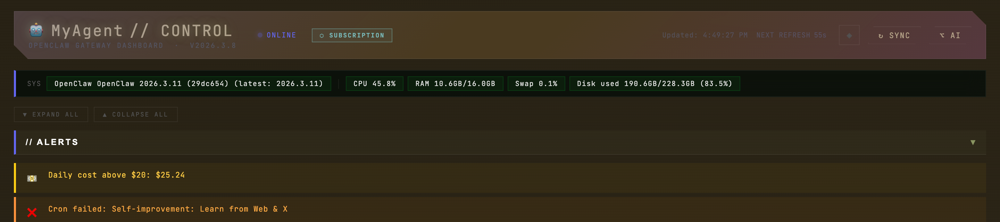
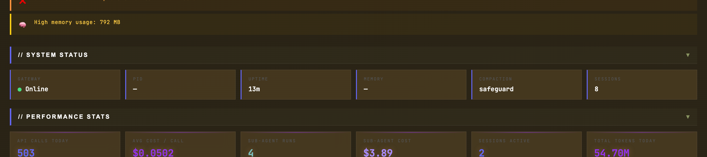
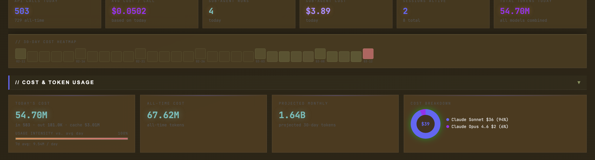
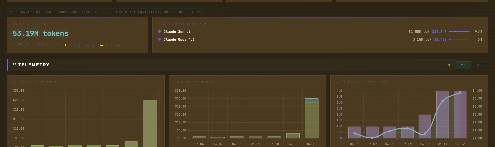
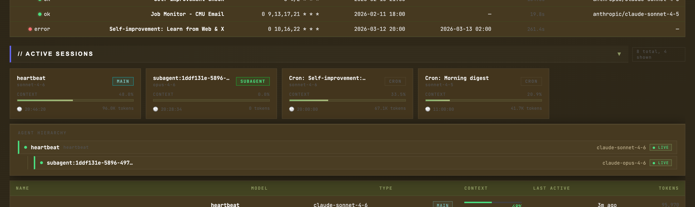
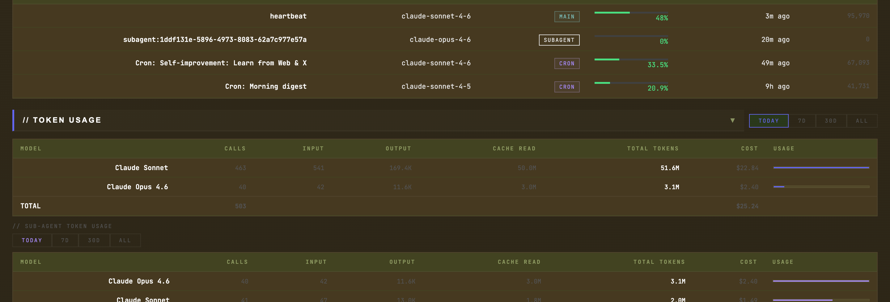

# WILL // CONTROL — OpenClaw Dashboard

> A terminal-aesthetic control panel for [OpenClaw](https://github.com/openclaw/openclaw) Gateway — real-time agent monitoring, billing-aware cost display, and a warm "Subdued Succulent" dark theme.



---

## Features

### Billing-Aware Cost Display
Auto-detects your billing model and shows the right metric — no misleading dollar figures for subscription users:

| Mode | What's shown |
|------|-------------|
| `subscription` | Token count + usage intensity bar |
| `api` | Dollar cost (daily / all-time / projected monthly) |
| `local` | Token count, $0 API cost |

Click the badge in the header to cycle modes. Preference persists in localStorage.



### Live Telemetry Charts
Three Chart.js bar charts — Daily Cost Trend, Cost by Model, Sub-Agent Activity — powered by live `/api/refresh` data.



### Session & Agent Monitoring
Per-session context-window progress bars, session tree, token usage tables with TODAY / 7D / 30D / ALL tabs.



### Token Usage Breakdown
Per-model token tables: input / output / cache-read / total — with sub-agent breakdown.


### Sub-Agent Run Cards
Grid view + table of every sub-agent run — cost, duration, model, status badge.



### Agent Configuration Panel
Full view of all agents, model routing chains, channels, hooks, capabilities, and bindings.



### More
- **30-Day Cost Heatmap** — colour-coded daily spend grid
- **Cron Job Grid** — 6-column status cards + table with last/next run
- **System Metrics** — CPU / RAM / SWAP / DISK pills with configurable warn/critical thresholds
- **Alerts Panel** — failed crons, high cost, high context usage
- **Vanta.js DOTS** animated background, CRT scanlines, JetBrains Mono font

---

## Quick Start

### 1. Install

```bash
# macOS ARM (pre-built binary)
curl -L https://github.com/mudrii/openclaw-dashboard/releases/latest/download/openclaw-dashboard-darwin-arm64 \
  -o openclaw-dashboard && chmod +x openclaw-dashboard

# Build from source (requires Go ≥ 1.21)
git clone https://github.com/yusenthebot/openclaw-dashboard
cd openclaw-dashboard
go build -o openclaw-dashboard .
```

### 2. Configure

```bash
cp examples/config.minimal.json config.json
# Edit config.json with your settings
```

Minimal `config.json`:

```json
{
  "bot": { "name": "MyAgent", "emoji": "🤖" },
  "billingMode": "subscription",
  "timezone": "America/New_York",
  "server": { "port": 8080, "host": "127.0.0.1" },
  "ai": { "enabled": true, "gatewayPort": 18789 }
}
```

### 3. Run

```bash
./openclaw-dashboard --port 8080
# → http://127.0.0.1:8080

# Background
nohup ./openclaw-dashboard --port 8080 > /tmp/dash.log 2>&1 &
```

---

## Configuration Reference

| Field | Default | Description |
|-------|---------|-------------|
| `bot.name` | `"OpenClaw Dashboard"` | Agent display name |
| `bot.emoji` | `"🦞"` | Agent emoji |
| `billingMode` | `"api"` | `subscription` / `api` / `local` |
| `timezone` | `"UTC"` | Display timezone (IANA) |
| `refresh.intervalSeconds` | `30` | Poll interval |
| `server.port` | `8080` | HTTP port |
| `server.host` | `"127.0.0.1"` | Bind address (localhost only by default) |
| `ai.gatewayPort` | `18789` | OpenClaw Gateway WebSocket port |
| `alerts.dailyCostHigh` | `50` | Red alert threshold ($) |
| `alerts.dailyCostWarn` | `20` | Yellow alert threshold ($) |
| `alerts.contextPct` | `80` | Context usage warning (%) |
| `system.warnPercent` | `70` | System metric warn threshold (%) |
| `system.criticalPercent` | `85` | System metric critical threshold (%) |

---

## Billing Mode Detection Order

1. **localStorage** — user clicked the header badge
2. **`config.json` → `billingMode`** — injected as `<meta name="oc-billing">` at startup
3. **Auto-detect from model name** — `ollama:*` / `lm-studio:*` / `local:*` → `local`, otherwise `api`

---

## Color Palette — Subdued Succulent

| Variable | Value | Role |
|----------|-------|------|
| `--bg` | `#282215` | Warm olive-brown background |
| `--accent` | `#A8B87A` | Sage green — primary accent |
| `--accent2` | `#D4905A` | Terracotta — secondary accent |
| `--cyan` | `#7ABCB8` | Jade teal — subscription, info |
| `--purple` | `#A890C8` | Aloe lavender — sub-agents |
| `--pink` | `#C88098` | Dusty rose — warnings |
| `--text` | `rgba(238,225,195,0.92)` | Warm cream text |

---

## Architecture

```
openclaw-dashboard (binary)
  ├── main.go              — CLI flags, startup
  ├── server.go            — HTTP server, /api/refresh, meta injection
  ├── config.go            — Config struct (+ billingMode field), JSON loader
  ├── system_service.go    — CPU/RAM/disk/swap collection
  ├── chat.go              — AI assistant WebSocket bridge
  └── index.html           — Embedded SPA (all UI/JS/CSS, ~128KB)
```

> The Go binary embeds `index.html` at compile time. After editing it, rebuild:
> ```bash
> go build -o openclaw-dashboard . && ./openclaw-dashboard --port 8080
> ```

---

## What's Different from Upstream

This fork of [mudrii/openclaw-dashboard](https://github.com/mudrii/openclaw-dashboard) adds:

- ✅ **Billing mode system** — subscription / API / local with smart auto-detect
- ✅ **Subdued Succulent theme** — warm earthy palette (replaces cold neon green)
- ✅ **Chart.js bar charts** — replacing SVG line charts
- ✅ **30-Day Cost Heatmap** — colour-coded daily cost grid
- ✅ **Session context bars** — per-session context-window usage with warnings
- ✅ **Sub-agent run cards** — grid + table with today/7d/30d/all tabs
- ✅ **Token usage tables** — per-model input/output/cache breakdown
- ✅ **Agent configuration panel** — agents, routing, channels, hooks, capabilities
- ✅ **Performance KPI row** — API calls, avg cost/call, active sessions
- ✅ **Vanta.js DOTS** background
- ✅ `calc_costs.py` — standalone JSONL cost scanner

---

## Requirements

- OpenClaw Gateway running locally
- Go ≥ 1.21 (source builds only)
- Tested: macOS arm64, Linux amd64

## License

MIT — see [LICENSE](LICENSE)
